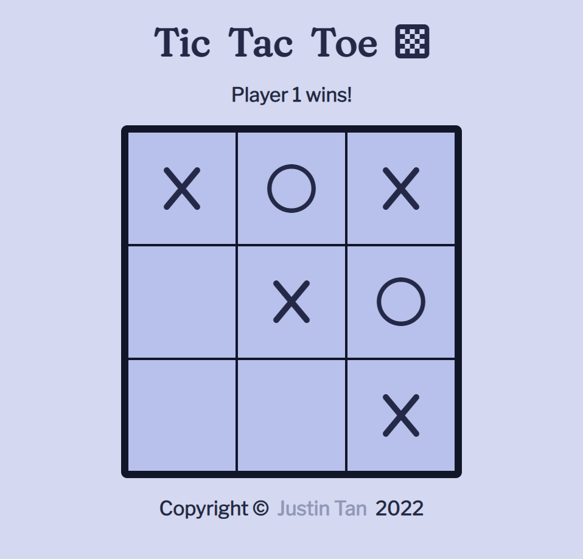

# TOP Template

This is an evolving template repository for my TOP projects.

## Live Preview

This project is hosted on **GitHub Pages**. Feel free to [:point_right: try it out](https://raineedust.github.io/tic-tac-toe/)!

## Motivation and Goals

- [x] Implement with modules and factories
- [x] Implement 3x3 grid
- [x] Implement gameplay interactions
- [x] Prevent interacted spots from future use
- [x] Implement winner condition
- [x] Implement tie condition
- [x] Implement status messages
- [x] Experiment with [Happy Hues](https://www.happyhues.co/palettes/12) palettes
- [ ] Implement restart

## Resources

Below are a collection of resources which helped improve my skills :sparkles: while building the project:

- [JavaScript Modules – Explained with Examples](https://www.freecodecamp.org/news/javascript-modules-explained-with-examples/)
- [html - Stylesheet not loaded because of MIME type - Stack Overflow](https://stackoverflow.com/questions/48248832/stylesheet-not-loaded-because-of-mime-type)
- [JavaScript Array forEach() Method](https://www.w3schools.com/jsref/jsref_foreach.asp)
- [HTML DOM Element appendChild() Method](https://www.w3schools.com/jsref/met_node_appendchild.asp)
- [Tic Tac Toe win conditions - General - The freeCodeCamp Forum](https://forum.freecodecamp.org/t/tic-tac-toe-win-conditions/188792)
- [How to Use font awesome icons as CSS content code](https://www.angularjswiki.com/fontawesome/csscontentcode/#step-3-set-the-css-content-code-for-the-icon)
- [Conditional branching: if, '?'](https://javascript.info/ifelse#conditional-operator)
- [HTML DOM Element setAttribute() Method](https://www.w3schools.com/jsref/met_element_setattribute.asp)
- [HTML DOM Element classList Property](https://www.w3schools.com/jsref/prop_element_classlist.asp)
- [JavaScript this](https://www.w3schools.com/js/js_this.asp)
- [CSS pointer-events property](https://www.w3schools.com/cssref/css3_pr_pointer-events.php)
- [arrays - Javascript push and loop - Stack Overflow](https://stackoverflow.com/questions/62157195/javascript-push-and-loop)

Built with :heart: to **The Odin Project**, a wonderful Web Development curriculum ~

## Acknowledgements

- [Font Awesome](https://fontawesome.com/)
- [Browse Fonts - Google Fonts](https://fonts.google.com/)
- [GitHub - sindresorhus/modern-normalize: 🐒 Normalize browsers' default style](https://github.com/sindresorhus/modern-normalize)
